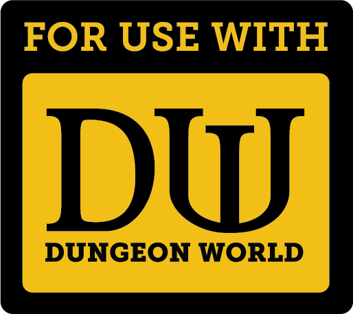
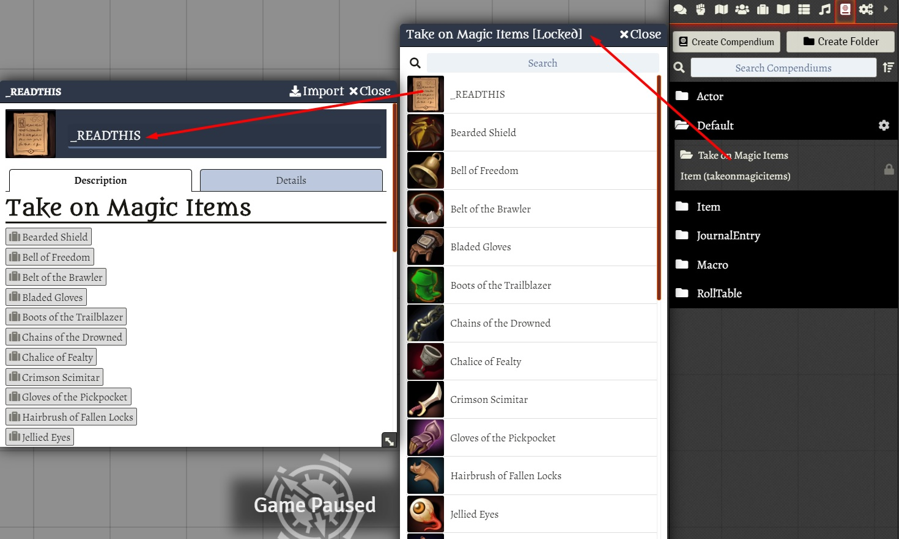

# Take on Magic Items (unofficial)

New magic items for Dungeon World. 

These items are from the **Take on Magic Items** from **Take On Rules (unofficial)**. You can get the PDF at: https://www.drivethrurpg.com/product/106849/Take-on-Magic-Items

  

  

# Install

## Manual Instalation
1. Go to **modules** and use the link: 
Use this: https://raw.githubusercontent.com/brunocalado/10plus-v2-moremagicitems/main/module.json

# Changelog
You can check changes at [CHANGELOG](CHANGELOG.md)

# License
You can check the license of this at page 9 from PDF. 

> “Take On Magic Items” by Jeremy Friesen is licensed under the Creative Commons Attribution 3.0 Unported License.

These items are from the **Take on Magic Items** from **Take On Rules (unofficial)**. You can get the PDF at: https://www.drivethrurpg.com/product/106849/Take-on-Magic-Items
